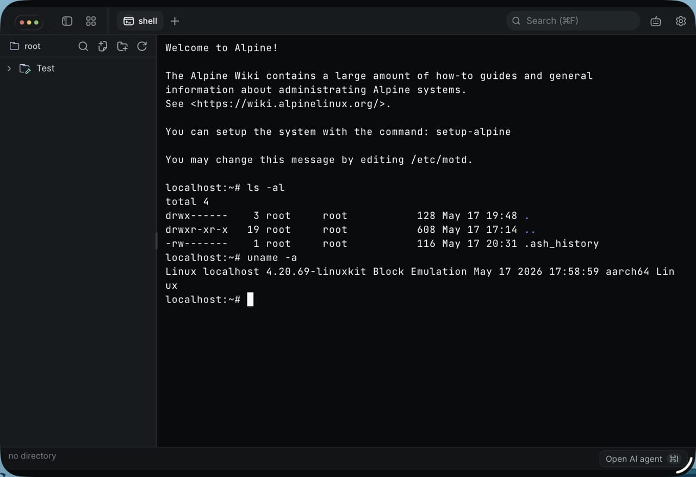

# Terax iOS LinuxKit Experimental Fork

This repository is an experimental fork of
[`crynta/terax-ai`](https://github.com/crynta/terax-ai). It is not the
upstream Terax desktop application and should not be treated as a stable
release branch.

The purpose of this fork is to make Terax run on iPadOS by replacing the
desktop host shell/filesystem assumptions with an embedded
[`ios-linuxkit`](https://github.com/rcarmo/ios-linuxkit) ARM64 Linux runtime.
The original upstream README is preserved verbatim in
[`ORIGINAL_README`](ORIGINAL_README).



## Current Goal

Terax started as a Tauri desktop terminal and AI workspace. Desktop builds run
commands through host PTYs, host shells, and the host filesystem. iOS cannot
provide that model directly, so this fork treats an embedded LinuxKit guest as
the execution environment:

- terminal sessions run inside the LinuxKit root filesystem
- shell tools and long-running commands are routed into the guest
- file explorer/editor operations are scoped to the guest filesystem
- iOS remains the app container, UI, keychain, and packaging host

This is a porting experiment, not an App Store-ready product.

## Broad Changes From Upstream

The fork keeps the Terax React/Tauri UI structure, but changes the mobile
backend and terminal plumbing:

- Added reproducible iOS helper scripts around Tauri, Xcode, and
  `../ios-linuxkit` in `scripts/ios-linuxkit.mjs`.
- Added project patching for the generated Tauri iOS Xcode project, including
  LinuxKit link flags and signing/build settings needed for `io.carmo.terax`.
- Embedded the `ios-linuxkit` root archive under
  `src-tauri/resources/ios-linuxkit/`.
- Added a native C bridge that boots the LinuxKit fakefs root, creates device
  nodes, mounts proc/devpts, configures DNS through Darwin `libresolv`, starts
  login shells, and connects LinuxKit TTYs to Tauri PTY channels.
- Added iOS-specific Rust command routing so existing Terax commands such as
  `pty_*`, `shell_*`, and `fs_*` can target LinuxKit on mobile while desktop
  builds keep their normal backends.
- Swapped the iOS terminal input model to match the reference `ios-linuxkit`
  terminal: Ghostty-Web renders the terminal, but native iOS text entry owns
  software and hardware keyboard input.
- Disabled Ghostty's Web text input surface on iOS and bridged native keyboard
  input back to the normal `pty_write` path.
- Added handling for terminal control/meta keys and special keys, including
  Escape, Tab, arrows, Home/End, Page Up/Down, Delete, F1-F12, application
  cursor mode, and Ctrl-C.
- Adjusted the iPad UI integration where needed for settings, status/header
  layout, and the left-side traffic-light spacing expected by the desktop UI.

## Repository Layout Assumption

Most iOS workflows assume the Terax fork and `ios-linuxkit` checkout are
siblings:

```text
../ios-linuxkit
./terax
```

Override the LinuxKit checkout with `IOS_LINUXKIT_DIR` if needed.

## iOS Build Commands

The iOS helper script prepends `TERAX_HOMEBREW_BIN` or
`.tmp-homebrew/bin` to `PATH`, so the build can use a temporary Homebrew
toolchain path instead of relying on the system prefix.

```bash
bun run ios:linuxkit:build # build ios-linuxkit static libraries
bun run ios:rootfs:sync    # copy ios-linuxkit root.tar.gz into Terax
bun run ios:prepare        # build linuxkit and sync the rootfs
bun run ios:build:device   # build a signed iOS device IPA
bun run ios:deploy         # install the IPA on IOS_DEVICE_ID
bun run ios:launch         # launch io.carmo.terax on IOS_DEVICE_ID
bun run ios:test-build     # prepare, build, and deploy
```

The default device ID is currently set in `scripts/ios-linuxkit.mjs`; override
it with `IOS_DEVICE_ID`.

## Status

The fork has a working iOS build/deploy path and a LinuxKit-backed terminal
bridge, but it is still under active debugging. The highest-risk areas remain
terminal fidelity, process lifecycle edge cases, LinuxKit filesystem mapping,
network behavior, and parity with the desktop UI.

Use the upstream project for normal Terax usage. Use this fork only when
working on the iOS/LinuxKit integration.
